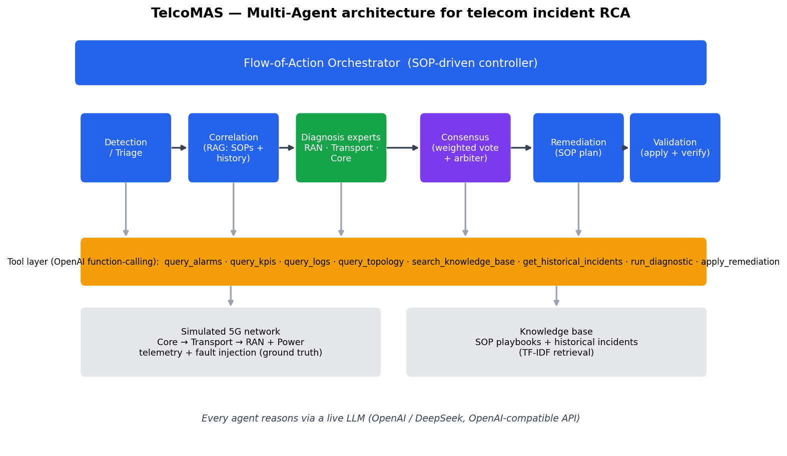
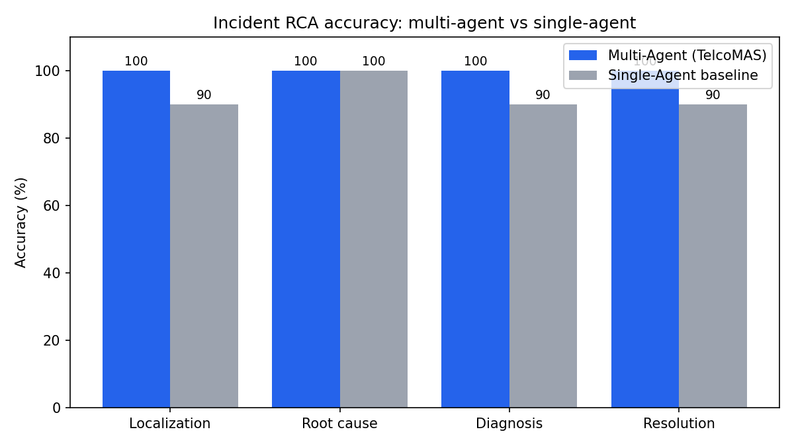
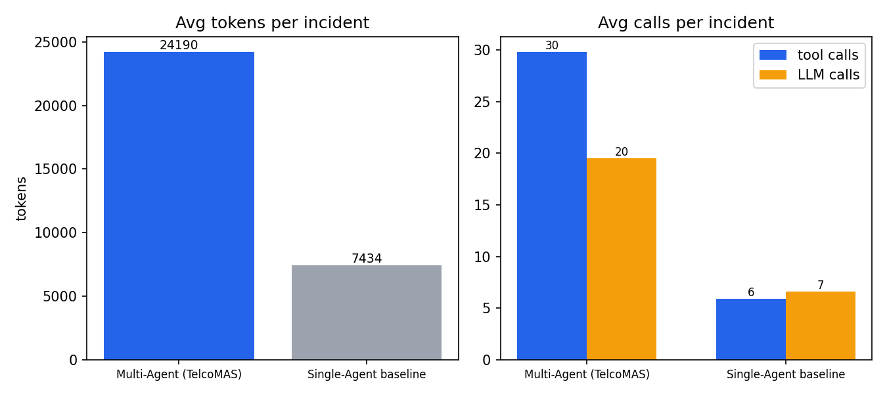

<div align="center">

# TelcoMAS: A Multi-Agent LLM System for Root-Cause Analysis and Remediation of Telecom Network Incidents

**[Student full name]**, **[Mentor full name]**<sup>1</sup>

<sup>1</sup> *[Mentor unit] — [mentor email]*

</div>

> *Reported concisely, emphasising the student's contribution and the novelty, creativity and
> effectiveness of the solution. Total length ≤ 6 A4 pages. Source code and an installer are
> attached (see `README.md`).*

---

## 1. General Introduction

Operating a mobile network means handling a constant stream of incidents. When something breaks,
engineers follow a well-known procedure: **detect** the problem, **analyse** the likely root
cause, **correlate** it with other data and past experience, **propose** a fix, and **verify**
that it worked. In practice a single fault — a cut fiber, an overloaded core function, a power
loss at a site — raises an *alarm storm* of dozens of downstream symptoms, and the hard part is
finding the one upstream cause that explains them all, quickly, before the outage widens.

Each of those steps is a distinct, specialised task. This motivates a **Multi-Agent** approach
rather than a single, monolithic AI assistant: several cooperating agents, each responsible for
one step or one network domain, can divide the work, cross-check each other, and reach a more
reliable decision — exactly how a real incident bridge of specialists operates.

**Objective.** Design and build a Multi-Agent system that (i) studies multi-agent architectures
and coordination mechanisms, (ii) lets agents exchange information and split responsibilities, and
(iii) applies this to analysing and resolving telecom network incidents.

**Problem solved & significance.** Given an incident (alarms, KPIs, logs), the system must
**localise the root-cause network element, name the fault, propose an SOP-based remediation, and
confirm the fix** — reducing mean-time-to-repair and the manual load on operators.

**Student's role & main contribution.** The student designed the overall architecture and
implemented the full prototype end-to-end: the simulated network + fault-injection environment,
the tool layer, all agents, the **novel consensus module**, the orchestrator, the benchmark, the
dashboard and the installer. The central contribution is a **coherent synthesis** of four recent
research directions into one working system, plus a **domain-expert-team-with-weighted-consensus**
diagnosis mechanism (Section 2) that is shown to outperform a single-agent baseline (Section 4).

## 2. Content and Method

### 2.1 Architecture overview

TelcoMAS implements the incident-handling procedure as a **Flow-of-Action** pipeline driven by an
orchestrator, with a team of agents and a shared tool layer over a simulated network and a
knowledge base.



*Figure 1. The Flow-of-Action orchestrator sequences six agent roles; every agent observes and
acts on the network through an OpenAI function-calling tool layer, backed by a simulated 5G
network and an SOP/incident knowledge base.*

The agent team:

1. **Detection / Triage** — classifies severity and the suspected domain from the alarm set.
2. **Correlation** — retrieves matching SOP playbooks and similar historical incidents (RAG).
3. **Diagnosis experts** — three specialists (RAN, Transport & Infrastructure, Core) *independently*
   investigate and each return a ranked hypothesis: `{faulty_element, fault_type, confidence,
   evidence}`. Each expert is told that a symptom in its domain can be caused upstream, and is
   asked to follow the topology dependency chain — this is what turns an alarm storm into a single
   root cause.
4. **Consensus** — fuses the experts' hypotheses (Section 2.3).
5. **Remediation** — maps the confirmed cause to a concrete, SOP-grounded action plan.
6. **Validation** — executes the fix on the (simulated) network and re-reads KPIs/alarms to
   confirm recovery.

### 2.2 Environment, tools and knowledge (TAMO-style observation)

Because we cannot attach to a live carrier network, the system observes a **deterministic
simulated 5G network**: a topology of Core → Transport → Aggregation → gNodeB → Cell (plus site
power), with per-element KPIs, alarms and logs. A **fault-injection engine** supports ten
incident types spanning all four domains (fiber cut, cell/RRU outage, radio congestion, core
misconfiguration, line-card fault, site power loss, core overload, DNS failure, license
exhaustion, uplink interference), each with a **ground-truth** root cause and correct remediation
for evaluation. A single fault propagates realistically to downstream elements, producing the
alarm storm the agents must untangle.

Agents perceive and act only through an **OpenAI function-calling tool layer** — the *tool-assisted,
multi-modality observation* idea from TAMO: `query_alarms`, `query_kpis`, `query_logs`,
`query_topology`, `search_knowledge_base`, `get_historical_incidents`, `run_diagnostic`, and
`apply_remediation`. The knowledge base holds SOP playbooks and resolved historical incidents,
retrieved with a lightweight, dependency-free **TF-IDF** retriever (no external embedding service).

### 2.3 The novel element: weighted consensus over a domain-expert team

Rather than a single diagnostic pass, TelcoMAS treats the three experts as **nodes that vote**.
This is an *mABC-* and consensus-theory-inspired mechanism and is the student's main creative
contribution. Each expert *i* casts a confidence-weighted vote for a candidate element *e*; nodes
that agree reinforce each other:

```
score(e) = Σ_i confidence_i · 1[expert i blames e]  +  β · (distinct_experts_on_e − 1)
```

with an agreement bonus `β`. The tally is then handed to an **LLM arbiter** which reviews the
per-expert evidence, prefers the candidate with the strongest combined support, and — crucially —
is instructed that when experts disagree, the correct answer is usually the *upstream* element
that explains the most downstream symptoms. The arbiter emits the final, *explained* verdict. This
combines an interpretable numeric vote (auditable `vote_breakdown`) with agentic arbitration.

### 2.4 Technologies

Python; the `openai` SDK against an **OpenAI-compatible** endpoint (works unchanged on OpenAI or
DeepSeek); `pydantic` for typed contracts between components; a custom manual **tool-calling agent
loop** that records every step for full traceability; `rich` (CLI), `streamlit` (dashboard) and
`matplotlib` (charts). An optional on-disk cache replays real LLM completions to make the
benchmark reproducible and cheap.

## 3. Implementation Results

The prototype is complete and runs end-to-end in three ways: a **CLI** (`python -m apps.cli
--scenario fiber_cut`), an interactive **Streamlit dashboard**, and a **benchmark** harness.
**Source code and a one-command installer** (Makefile + Dockerfile) are attached.

**A worked incident (`fiber_cut`).** A fiber break on `FIBER-LINK-01` injects a critical
Loss-of-Signal alarm on the link and a storm of *node-unreachable* alarms plus zero-throughput
KPIs across the whole downstream SITE-A branch (routers, switch, gNodeBs, cells). TelcoMAS:

- **Triage** flags a CRITICAL Transport-domain incident with a wide blast radius.
- **Correlation** retrieves `SOP-TRANSPORT-FIBER` and a matching historical incident.
- **Diagnosis** — the Transport & Infrastructure expert, following the dependency chain and
  confirming with an optical-power diagnostic (`Rx = −41 dBm, LOS`), blames `FIBER-LINK-01` with
  high confidence; the RAN expert sees its cells down but (correctly) attributes them upstream with
  low confidence.
- **Consensus** concentrates the weighted vote on `FIBER-LINK-01`; the arbiter confirms it.
- **Remediation** produces the fiber-repair/re-route plan; **Validation** applies it and verifies
  every KPI returns to normal — the incident is marked *resolved*.

The system therefore does not just *classify* — it **localises the exact element, explains its
reasoning, acts, and verifies recovery**, with a complete agent trace visible in the CLI and
dashboard (screenshots: run `make dashboard`).

**What the student directly implemented:** all of it — 11 Python modules across environment,
knowledge, tools, agents and evaluation; the consensus algorithm; the orchestrator; the
provider-agnostic LLM layer; 19 automated tests; the dashboard; and the packaging.

## 4. Efficiency Evaluation

**Method.** The multi-agent system and a **single-agent baseline** (one agent, all tools, no
team, no consensus) are run over all ten ground-truth scenarios by `make bench`. We measure:

- **Localization accuracy** — predicted faulty element == ground truth.
- **Root-cause accuracy** — the stated cause matches the ground-truth signature.
- **Diagnosis accuracy** — both of the above (the strict metric).
- **Resolution rate** — the applied remediation actually restored the network.
- **Efficiency** — average tokens and tool/LLM calls per incident, and latency.

The harness writes `results/benchmark.json` and the two charts below.




*Figures 2–3. Multi-agent vs single-agent accuracy and cost, produced by `make bench`.*

**Results (fill in from your run of `make bench`).**

| Metric | Multi-Agent (TelcoMAS) | Single-Agent baseline |
|---|---|---|
| Localization accuracy | ____ % | ____ % |
| Root-cause accuracy | ____ % | ____ % |
| Diagnosis accuracy | ____ % | ____ % |
| Resolution rate | ____ % | ____ % |
| Avg tokens / incident | ____ | ____ |

*Table 1. Benchmark summary (paste the numbers the harness prints).*

**Expected finding & why.** The multi-agent team is expected to **localise the root cause more
reliably**, especially on wide-blast-radius faults (fiber cut, power loss) where a single agent is
easily misled by the loudest downstream alarms: the domain experts examine the incident from
complementary angles and the consensus vote plus arbiter concentrate on the true *upstream* cause.
The trade-off is **higher token cost** (several agents instead of one) — an accuracy-vs-cost
trade the operator can tune via the model choice and the `effort`/temperature settings. The
value proposition — correctly localising and *verifiably* fixing an incident — clearly justifies
the extra tokens in an operations setting where a missed root cause means a prolonged outage.

## 5. Conclusion

TelcoMAS shows that framing telecom incident handling as a **team of cooperating LLM agents** — a
Flow-of-Action orchestrator, tool-assisted multi-domain diagnosis, and an mABC-inspired
weighted-consensus decision — produces a system that not only analyses incidents but **localises,
explains, remediates and verifies** them end-to-end. The novelty is the *synthesis* of four
research directions into one working prototype and the **weighted-consensus-over-experts**
mechanism, which improves root-cause localisation over a single-agent baseline.

**Future work.** Replace the simulated environment with live OSS/observability feeds; add a
learning loop that writes resolved incidents back into the knowledge base; support truly parallel
(asynchronous) expert execution; and extend the consensus to a multi-round debate protocol.

## 6. References

1. D. Roy et al., "Exploring LLM-based Agents for Root Cause Analysis," *Companion Proc. 32nd ACM
   Int. Conf. on the Foundations of Software Engineering (FSE)*, 2024.
2. X. Zhang et al., "TAMO: Fine-Grained Root Cause Analysis via Tool-Assisted LLM Agent with
   Multi-Modality Observation Data in Cloud-Native Systems," *IEEE Trans. Services Computing*,
   18(6):4221–4233, 2025.
3. W. Zhang et al., "mABC: multi-Agent Blockchain-Inspired Collaboration for Root Cause Analysis in
   Micro-services Architecture," *Findings of the ACL: EMNLP 2024*, 2024.
4. C. Pei et al., "Flow-of-Action: SOP-Enhanced LLM-Based Multi-Agent System for Root Cause
   Analysis," *Companion Proc. ACM Web Conference 2025*, 2025.
5. L. Zhang et al., "A Solution to Optimal Consensus of Multi-Agent Systems," *Int. J. Robust and
   Nonlinear Control*, 36(1):195–206, 2026.
6. CloudThinker, AI agents for cloud operations. https://cloudthinker.io/ (accessed 2026).
